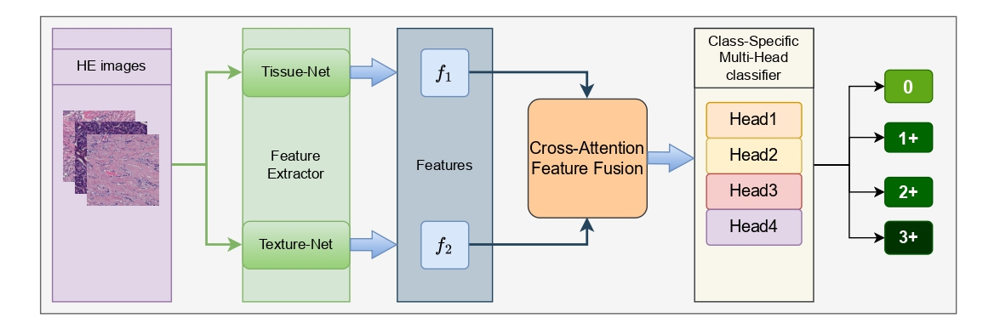
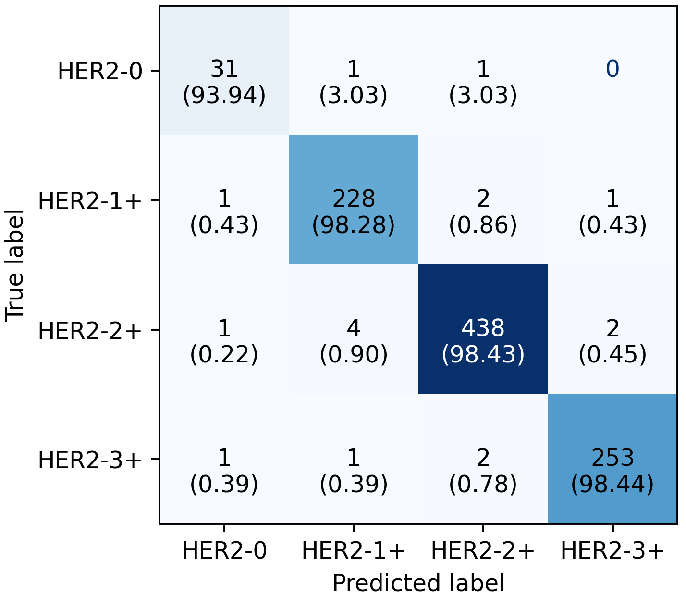
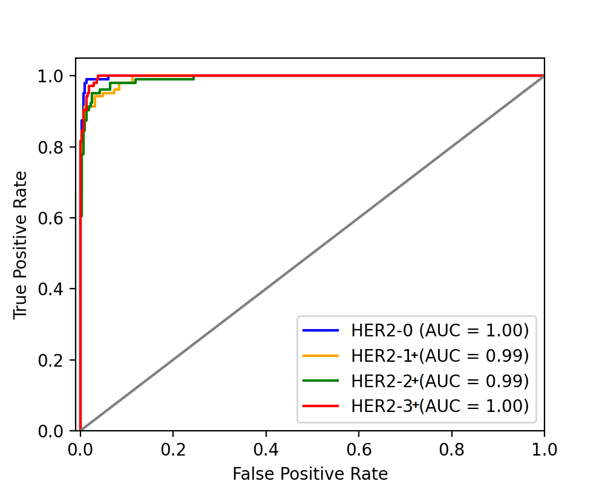

# HER2FusionNet: Multi-Head Cross-Attention Fusion for HER2 Classification

This repository contains the official implementation of **HER2FusionNet**, a deep learning framework designed for the 4-class classification of HER2 status (HER2-0, HER2-1+, HER2-2+, and HER2-3+) from histopathology image patches.

The architecture utilizes a dual-branch feature extraction system (Tissue-Net and Texture-Net) integrated through a 3-head cross-attention mechanism and a class-specific multi-head classification layer.

---

## 🔬 Model Architecture

The model consists of the following primary components:

1. **Tissue-Net:** Extracts structural and morphological features from 128×128 input patches.

2. **Texture-Net:** Utilizes learnable Gabor convolutional layers to capture fine-grained texture details from 256×256 input patches.

3. **Cross-Attention Fusion:** Aligns and fuses features from both branches using a multi-head attention mechanism.

4. **Class-Specific Multi-Heads:** Four independent classification heads specialized in identifying individual HER2 categories to reduce inter-class confusion.

   

---

## 📂 Dataset organisation

The evaluation and training of HER2FusionNet were performed using the **BCI (Breast Cancer Immunohistochemistry)** dataset. This is a publicly available dataset for academic research.

* **Dataset Access:** [BCI Dataset Official Repository](https://bupt-ai-cz.github.io/BCI/)

The code is designed to work with the BCI dataset and tested on BCNB dataset.

Ensure your data is organized in the following directory structure:

```text
Data/
├── train/
│   ├── HER2_0/
│   ├── HER2_1/
│   ├── HER2_2/
│   └── HER2_3/
│
├── validate/
│   ├── HER2_0/
│   ├── HER2_1/
│   ├── HER2_2/
│   └── HER2_3/
│
└── test/
    ├── HER2_0/
    ├── HER2_1/
    ├── HER2_2/
    └── HER2_3/
```
---

## 🚀 Getting Started

### 1. Installation

Clone the repository and install the required dependencies:

```bash
git clone https://github.com/YOUR_USERNAME/HER2FusionNet.git
cd HER2FusionNet
pip install -r requirements.txt
```

---

### 2. Preprocessing

To extract patches and remove blank background patches from the raw BCI images, run:

```bash
python patch_generator.py
```

---

### 3. Training

To train the model using the class-specific multi-head architecture:

```bash
python her2_full_pipeline.py
```

The script will automatically save the best-performing weights as:

```text
best_her2_model.pth
```

based on validation accuracy.

---

### 4. Evaluation

To evaluate the model on the test set and generate the classification report and confusion matrix:

```bash
python evaluate_model.py
```

---

## 📊 Results

The evaluation script generates a detailed classification report and visual performance metrics.

### Confusion Matrix
The matrix below illustrates the model's performance across the four HER2 categories (0, 1+, 2+, 3+), highlighting the specialized multi-head classifier's ability to distinguish between adjacent classes.



### ROC Curve
The Receiver Operating Characteristic (ROC) curve demonstrates the diagnostic sensitivity and specificity of the HER2FusionNet architecture.



### Performance Metrics
- **Precision, Recall, and F1-Score** are calculated for each class to ensure balanced performance across the HER2 spectrum.

---

## 📌 Notes

1. Replace `YOUR_USERNAME` in the installation section with your actual GitHub username.
2. Dataset: * **BibTeX:**
```bibtex
@INPROCEEDINGS{9857332,
  author={Liu, Shengjie and Zhu, Chuang and Xu, Feng and Jia, Xinyu and Shi, Zhongyue and Jin, Mulan},
  booktitle={2022 IEEE/CVF Conference on Computer Vision and Pattern Recognition Workshops (CVPRW)}, 
  title={BCI: Breast Cancer Immunohistochemical Image Generation through Pyramid Pix2pix}, 
  year={2022},
  pages={1814-1823},
  doi={10.1109/CVPRW56347.2022.00198}
}


